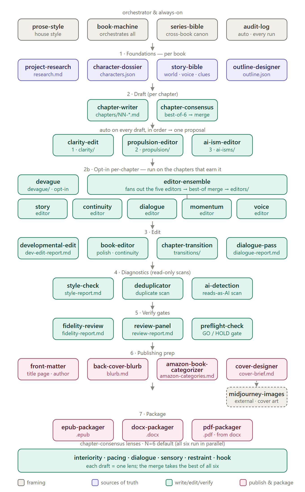

# The Book Machine — Claude Code Skills

A modular "book machine" built as a set of [Claude Code Agent Skills](https://docs.claude.com/en/docs/claude-code/skills). Each stage is its own skill; they hand off to each other through plain files in a shared **book project folder**, so any stage can be run on its own or re-run later.

The whole suite as a phased pipeline:



*(GitHub previews the PNG above; for the crisp, scalable source see [docs/skill-map.svg](docs/skill-map.svg). Regenerate the PNG from the SVG whenever the diagram changes.)*

**New here?** Read [GETTING-STARTED.md](GETTING-STARTED.md) for the walkthrough, or [SKILLS.md](SKILLS.md) for a full description of every skill and what each skill folder contains.

**Just want the files?** Download [**`book-machine-skills.zip`**](book-machine-skills.zip) — all 37 skills in one archive, ~485 KB. See [Installing](#installing).

## The skills

| Skill | Role |
|-------|------|
| `book-machine` | Orchestrator — runs the stages in order with review checkpoints |
| `story-bible` | Builds `story-bible.md` — world rules, voice & style guide, plot beats |
| `series-bible` | Cross-book continuity for a series — `series-bible.md` + `series.json` above the book folders |
| `character-dossier` | Interviews the user, builds the cast in `characters.json` (name, want, fear, secret) |
| `prose-style` | The house writing style the suite obeys — em-dash removal, sentence rules, AI-ism avoidance (Part 3 summarizes; the catalog lives in `ai-ism-editor/`) |
| `ai-ism-editor` | Active per-chapter de-AI pass + **owner of the AI-ism catalog** (`references/ai-isms.md`, `scripts/ai_ism_flags.py`) → `ai-isms/` proposal; auto-fires on each draft after propulsion-editor |
| `project-research` | Captures per-book research/sources into `research.md` (+ `research/`) for the writing to draw on |
| `fidelity-review` | Verification gate — audits the writing against the sources of truth for drift/hallucination, reports, loops to resolution |
| `review-panel` | Pre-publish gate — a panel of independent reviewers reads the whole book, reports consensus issues + READY/NOT-READY |
| `deduplicator` | QA scan — flags duplicated content (exact/near-duplicate chapters, repeated passages and sentences); read-only, reports only |
| `preflight-check` | Final pre-publish sanity check — reconciles the book + confirms the gates closed; `preflight-report.md` GO/HOLD (`scripts/preflight.py`) |
| `outline-designer` | Topic/notes → title + chapter plan (`outline.json`, `book.json`) |
| `chapter-writer` | Briefs → full chapter prose (`chapters/NN-*.md`); honors the dossier |
| `chapter-consensus` | Best-of-N drafting — fans out 6 lensed chapter-writers in parallel, merges the strongest into `consensus/.../merged.md` |
| `clarity-edit` | Per-chapter clarity pass (nonsense, vocab, failed metaphors, tangled syntax) → report + edited proposal in `clarity/`; auto-fires on each draft |
| `propulsion-editor` | Per-chapter forward-motion pass — rewrites for pull (dramatic question, causal progression, active verbs, unresolved ending) + "earn the length" → `propulsion/` proposal; auto-fires on each draft after clarity-edit |
| `editor-ensemble` | Best-of-5 per-chapter editing — fans out the five active editors in parallel and merges the best of each into `editors/.../merged.md`; opt-in, run on the chapters that earn the extra cost |
| `story-editor` | Active editor — strengthens story quality (scene purpose, stakes, tension, the turn, payoff) |
| `continuity-editor` | Active editor — fixes continuity drift vs the bible/characters/prior chapters (the per-chapter cousin of fidelity-review) |
| `dialogue-editor` | Active editor — rewrites dialogue sharp and propulsive; cuts boring, on-the-nose, and expository lines |
| `momentum-editor` | Active editor — tightens slow spots and cuts or refocuses diversions that don't advance plot or character |
| `voice-editor` | Active editor — holds the book's constant voice and enforces prose-style |
| `devague` | Surgical de-vaguing pass — replaces vague placeholders (something/thing/shape) with precise words → `devague/` proposal; opt-in per chapter |
| `developmental-edit` | Structural revision roadmap (the "editorial letter") into `dev-edit-report.md`; proposes, never rewrites |
| `book-editor` | Whole-manuscript consistency / continuity / polish pass |
| `style-check` | Deterministic prose linter (crutch/filler words, adverbs, echoes, reading level, em-dashes) → `style-report.md` (`scripts/style_check.py`) |
| `dialogue-pass` | Focused dialogue craft review (distinct voices, tags/beats, on-the-nose) → `dialogue-report.md`; read-only |
| `ai-detection` | Heuristic "reads-as-AI" scan (burstiness, AI-isms, transitions) → `ai-detection-report.md` (`scripts/ai_likelihood.py`); not a real detector |
| `chapter-transition` | Proposes optional connective passages between chapters into `transitions/`; never edits chapters |
| `front-matter` | Fills book.json metadata (author!) + authors title/copyright/dedication/epigraph/about-author into `front-matter/` |
| `epub-packager` | Assembles chapters into a valid `.epub` (Python stdlib, `scripts/build_epub.py`) |
| `docx-packager` | Assembles chapters into a Word `.docx` (Python stdlib, `scripts/build_docx.py`) |
| `pdf-packager` | Renders the `.docx` to a print-ready `.pdf` via Word/LibreOffice (`scripts/build_pdf.py`) |
| `back-cover-blurb` | Publishing prep — writes marketing copy (blurb, description, tagline) into `blurb.md`; honors the spoiler wall |
| `cover-designer` | Publishing prep — writes a cover brief + Midjourney prompts into `cover-brief.md`; hands off to `midjourney-images` |
| `amazon-book-categorizer` | Publishing prep — recommends KDP categories + keywords into `amazon-categories.md` |
| `midjourney-images` | Generates cover/illustration art in your own Midjourney account by driving the Claude for Chrome extension (`scripts/overlay_cover_text.py` for legible lettering) |

## Audit log

Every skill records each run to `audit-log.md` (and `audit-log.jsonl`) in the book folder — that it ran, its result (pass/fail or verdict), the items it went through, and the outputs it wrote — via the shared `lib/audit_log.py`. The convention is in [`lib/AUDIT-LOG.md`](lib/AUDIT-LOG.md). Read `audit-log.md` to see everything that has happened to a book at a glance.

## Shared project-folder contract

```
<book-folder>/
├── book.json            # metadata + spec (title, subtitle, author, series, audience, tone, status)
├── research.md          # (optional) factual source material — project-research skill
├── story-bible.md       # (stories) world rules, voice & style, plot beats
├── characters.json      # (stories) the cast dossier (name, want, fear, secret)
├── outline.json         # { title, chapters: [{ id, title, brief, targetWords }] }
├── chapters/            # one markdown file per chapter: NN-slug.md, "# Title" then prose
├── front-matter/        # (optional) title page + dedication/copyright/etc. — front-matter skill
├── transitions/         # (optional) connective passages between chapters
├── blurb.md             # (optional) marketing copy — back-cover-blurb skill
├── amazon-categories.md # (optional) KDP categories + keywords — amazon-book-categorizer skill
├── cover-brief.md       # (optional) cover brief + Midjourney prompts — cover-designer skill
└── dist/                # generated .epub / .docx / .pdf
```

The **book-machine** skill carries the authoritative, full contract (a series adds a
`series-bible.md` + `series.json` one level above the book folders).

## Installing

These are **personal Claude Code skills**, so they must live in the personal skills directory:

- **Windows:** `C:\Users\<you>\.claude\skills\`
- **macOS/Linux:** `~/.claude/skills/`

Three ways to install:

1. **Download the archive** — [**`book-machine-skills.zip`**](book-machine-skills.zip) (~485 KB, all 37 skills, no git required). Unzip it and copy the contents of the `book-machine-skills/` folder into your skills directory:
   ```bash
   unzip book-machine-skills.zip
   cp -r book-machine-skills/* ~/.claude/skills/
   ```
2. **Clone into the skills folder** (if it's empty):
   ```bash
   git clone <this-repo-url> ~/.claude/skills
   ```
3. **Or clone elsewhere and copy the skill folders** into `~/.claude/skills/`:
   ```bash
   git clone <this-repo-url> book-machine-skills
   cp -r book-machine-skills/* ~/.claude/skills/   # copy the skill folders
   ```

You do not need every skill. Each folder is self-contained, so copy only the ones you want; `prose-style` and `book-machine` are the two most worth taking.

Start a new Claude Code session and the skills register automatically. The packager scripts need only **Python 3** (standard library — no extra installs).

## Requirements

- Claude Code (the skills run inside it — no API key needed; Claude Code is the engine)
- Python 3 (for the packager, deduplicator, and keyword-lint scripts — standard library only)
- Microsoft Word or LibreOffice, only if you want the `pdf-packager` to render a PDF
- The Claude for Chrome extension, only if you want `midjourney-images` to drive Midjourney

## License

MIT. See [LICENSE](LICENSE). Use them, fork them, adapt them to your own writing.

The license carries `<YourName>` and `<YourEmail>` placeholders. Replace both with your own details before you publish or redistribute, so the copyright line names a real holder.
